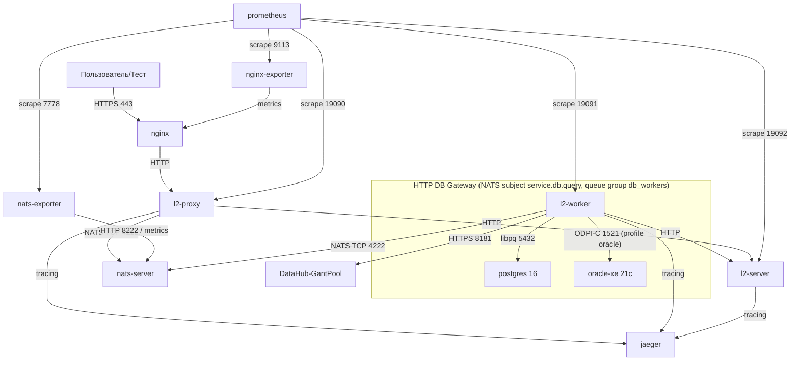
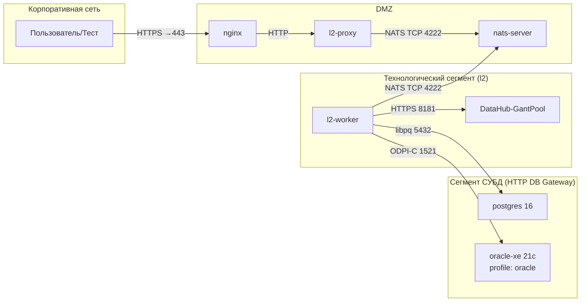

# Схема сетевых взаимодействий сервисов http-data-diod

## Транспорт сообщений

Система использует **NATS** для обмена сообщениями между `l2-proxy` и `l2-worker`:

- `l2-proxy` отправляет запрос в `nats-server`
- `l2-worker` подписан на NATS subject и получает запрос
- `l2-worker` отвечает через NATS request/reply
- `l2-proxy` получает ответ и возвращает его клиенту

---

## Визуальная схема взаимодействий



**Обозначения:**  
- Направление стрелки: всегда КЛИЕНТ 👉 СЕРВЕР.
- Надписи на стрелках = используемый протокол и порт.

---

## Сетевая схема с разделением сегментов



---

## Путь доставки запросов между proxy и worker

```text
client -> nginx -> l2-proxy -> NATS -> l2-worker -> DataHub/GantPool
client <- nginx <- l2-proxy <- NATS <- l2-worker <- DataHub/GantPool

HTTP DB Gateway (read-only SQL over NATS):
client -> nginx -> l2-proxy -> NATS (service.db.query) -> l2-worker -> PostgreSQL / Oracle
client <- nginx <- l2-proxy <- NATS (service.db.query) <- l2-worker <- PostgreSQL / Oracle
```

Особенности:
- ближе к классическому messaging/request-reply
- меньше логики хрнения промежуточного состояния в proxy/worker
- проще строить лёгкий messaging-only контур
- хорошо подходит для событийной и message-driven архитектуры
- требует корректной настройки subject/request-reply semantics и доступности messaging-сервера

---

## Практическая рекомендация

Текущая реализация и деплой-конфигурация ориентированы на **NATS-only** сценарий.  
Все упоминания ранее использовавшегося Redis/Valkey пути удалены из актуальной документации и конфигурации.

---

## HTTP DB Gateway (шлюз к базам данных)

`l2-proxy` и `l2-worker` реализуют опциональный **HTTP DB Gateway**: SQL-запросы (read-only) к СУБД проксируются через тот же NATS-транспорт, что и основной трафик, но по отдельному subject `service.db.query` (queue group `db_workers`). Воркер держит пулы соединений с СУБД и исполняет запросы, не затрагивая основной HTTP-маршрут к DataHub/GantPool.

Поддерживаемые СУБД:

| Драйвер | Образ / протокол | Статус по умолчанию | Включение |
|---|---|---|---|
| PostgreSQL | `postgres:16-alpine`, libpq, порт 5432 | **включён** (`DB_POSTGRES_ENABLED=true`) | поднят в `docker-compose.yml` |
| Oracle | `gvenzl/oracle-xe:21.3.0-slim`, ODPI-C / Instant Client 21.13, порт 1521 | **отключён** (`DB_ORACLE_ENABLED=false`) | profile `oracle` + `DB_ORACLE_ENABLED=true` |

Весь шлюз включается/выключается флагом `DB_QUERY_ENABLED` (default `true`). Подробный пример с командами и выводом — в `docs/http-db-gate-example.md`.

Ключевые переменные окружения см. в `docker-compose.yml` (`DB_QUERY_*`, `DB_POSTGRES_*`, `DB_ORACLE_*`); метрики воркера по шлюзу эмитируются через `l2_worker_*` (см. дашборд `L2 Воркер`).

---

## Rate limiting

Rate limiting применяется **только к `l2-proxy`** (в режиме `MODE=proxy`); воркер и l2-server не лимитируются. Два независимых уровня:

- **Глобальный** — на все запросы прокси (token bucket на процесс).
- **Per-IP** — на запросы с одного IP (token bucket на IP + LRU-кэш с TTL-очисткой).

При превышении лимита возвращается `429 Too Many Requests` с заголовками `Retry-After`, `X-RateLimit-Limit`, `X-RateLimit-Remaining`.

### Настройка (переменные окружения)

| Переменная | Default | Описание |
|---|---|---|
| `ENABLE_GLOBAL_RATE_LIMITING` | `true` | Полное включение/отключение глобального лимитера |
| `GLOBAL_RATE_LIMIT_MAX_TOKENS` | `10000` | Burst-ёмкость глобального бакета (макс. мгновенный всплеск до 429) |
| `GLOBAL_RATE_LIMIT_REFILL_RATE` | `1000` | Sustained rate: пополнение токенов/сек = допустимый постоянный req/s |
| `ENABLE_PER_IP_RATE_LIMITING` | `true` | Включение per-IP лимитера (в compose — `true`; для trip-теста занизь лимиты через `docker-compose.ratelimit.yml`) |
| `PER_IP_MAX_TOKENS` | `10000` (compose) | Burst-ёмкость бакета на IP |
| `PER_IP_REFILL_RATE` | `1000` (compose) | Sustained req/s per IP |
| `PER_IP_MAX_IPS` | `10000` | Максимум отслеживаемых IP; при превышении новые IP получают 429 |
| `PER_IP_CLEANUP_TTL_SECONDS` | `300` | Idle-время до вытеснения IP из кэша |

Дефолтные лимиты per-IP (в `docker-compose.yml`) специально щадящие — чтобы нагрузочное тестирование не резалось `429`. Чтобы продемонстрировать отказы по IP, разверните с малыми лимитами (`docker-compose.ratelimit.yml`) или через env. Для нагрузочного тестирования без лимитеров отключите оба через `ENABLE_GLOBAL_RATE_LIMITING=false` (+ `ENABLE_PER_IP_RATE_LIMITING=false`).

### Метрики Prometheus

- `l2_rate_limiter_tokens` — доступные токены глобального бакета (gauge).
- `l2_rate_limiter_rejected_total` — запросы, отброшенные глобальным лимитером (counter).
- `l2_per_ip_rate_limiter_rejected_total` — запросы, отброшенные per-IP лимитером (counter).
- `l2_proxy_per_ip_rate_limiter_ips_tracked` — число отслеживаемых IP (gauge).
- `l2_proxy_per_ip_requests_total{ip="..."}` — запросы по каждому IP (counter; label `ip`, кастомный коллектор).
- `l2_proxy_per_ip_rejected_total{ip="..."}` — отказы по каждому IP (counter; label `ip`, кастомный коллектор).
- `l2_proxy_per_client_id_requests_total{client_id="..."}` — запросы по значению заголовка `X-DataHub-Client-Id` (counter; label `client_id`, кастомный коллектор). Позволяет различать клиентов, работающих из-под одного IP.
- `l2_proxy_per_client_id_rejected_total{client_id="..."}` — отказы по каждому клиенту `X-DataHub-Client-Id` (counter; label `client_id`, кастомный коллектор).
- `l2_proxy_per_client_id_latency_seconds{client_id="..."}` — задержка обработки запроса по каждому клиенту `X-DataHub-Client-Id` (histogram; label `client_id`, кастомный коллектор) — p50/p95/p99 по клиентам в Grafana.

#### Насыщенность и доступность (observability-обогащение)

- `l2_proxy_responses_total{status="..."}` — ответы прокси по HTTP-статусу (counter family). База для панелей error-rate / SLO.
- `l2_proxy_in_flight_requests` — число одновременно обрабатываемых HTTP-запросов прокси (gauge, насыщенность).
- `l2_proxy_nats_connected` — состояние связи прокси с NATS (1/0, gauge).
- `l2_proxy_health_ready` — готовность прокси по `/health/ready` (1/0, gauge).
- `l2_worker_responses_total{status="..."}` — ответы воркера, отданные по NATS, по HTTP-статусу (counter family).
- `l2_worker_in_flight_requests` — запросы, обрабатываемые воркером прямо сейчас (gauge).
- `l2_worker_queue_size` — глубина очереди пула потоков воркера (gauge, ранний сигнал backpressure); опрашивается фоновым тикером раз в ~5с.
- `l2_worker_nats_connected` — состояние связи воркера с NATS (1/0, gauge).
- `l2_worker_health_ready` — готовность воркера по `/health/ready` (1/0, gauge).
- `l2_server_responses_total{status="..."}` — ответы L2-сервера по HTTP-статусу (counter family).
- `l2_server_health_ready` — готовность L2-сервера (1/0, gauge; выставляется при старте, т.к. у сервера нет блокирующих зависимостей).

В дашбордах `l2-proxy` / `l2-worker` / `l2-server` добавлен ряд «Статус-коды, насыщенность и доступность»: ответы по статусам (stacked), доля ошибок 4xx/5xx, in-flight, очередь воркера, NATS-связь и готовность (stat 0/1), а также производные панели RPS «успешные vs ошибки». Для алертинга (VictoriaMetrics/Prometheus) на базе этих метрик рекомендуется:

- `error_rate = sum(rate(l2_*_responses_total{status=~"4..|5.."}[5m])) / clamp_min(sum(rate(l2_*_responses_total[5m])), 0.0001)` — пороги 5% (warning) / 20% (critical);
- `nats_connected == 0` и `health_ready == 0` за >1м (недоступность/потеря связи);
- рост `in_flight_requests` / `queue_size` выше нормы (backpressure до отказов).

Панель «Хот-клиенты» в Grafana (bar gauge) показывает топ client-id с нагрузкой, нормированной к самому горячему клиенту (1.0): горячие клиенты красные, длинный хвост обычных — зелёный. Эмуляцию хот-клиентов в нагрузочном тесте включают `--hot-clients N --hot-share 0.8` (доля запросов от фиксированных id `hot-client-1..N`). Для непрерывной нагрузки заданной длительности (например, чтобы наполнить 5m-окно rate) вместо `--iterations` используют `--duration <секунды>` — тест шлёт запросы без пауз с конвейером «в полёте ≤ `--concurrent`», пока не истечёт время.

### Трейсинг отказов rate limiter

Ответ `429` эмитится до основного трейсинга (`setup_tracing`), поэтому для отказов лимитера создаётся отдельный span с атрибутами:

- `rate_limit.reason` — `global` или `per_ip`;
- `rate_limit.client_ip` — IP клиента;
- `rate_limit.limit` / `rate_limit.remaining` — ёмкость бакета и остаток токенов на момент отказа.

Если клиент прислал заголовок `traceparent`, span привязывается к этому трейсу как дочерний; иначе создаётся новый трейс. Позволяет в Jaeger отличать 429-шторм глобального лимитера от per-IP.

### Тест

`python3 rate_limit_test.py` — интеграционный тест лимитера. Ожидание (`429` под нагрузкой или его отсутствие) выводится из `ENABLE_GLOBAL_RATE_LIMITING` (или флагов `--expect-429`/`--expect-zero`).

Для быстрой детерминированной проверки `429` разверните стек с маленьким лимитом:

```bash
docker compose -f docker-compose.yml -f docker-compose.ratelimit.yml up -d
python3 rate_limit_test.py --expect-429
```

Проверка отключённого лимитера (при `ENABLE_GLOBAL_RATE_LIMITING=false`):

```bash
python3 rate_limit_test.py --expect-zero
```

---

## Отказоустойчивость (fault tolerance)

`python3 fault_tolerance_test.py` — интеграционный набор, который по очереди «роняет» одну зависимость стека через `docker compose stop`, проверяет ожидаемое поведение и восстанавливает сервис (`docker compose start`). Все сценарии в конце возвращают стек в healthy-состояние.

| Сценарий | Что делается | Что проверяется |
|---|---|---|
| `nats` | Рестарт `nats-server` | proxy/worker переходят в `not_ready` (503), после восстановления NATS возвращаются к 200; `message_counter.py` проходит без потерь |
| `server` | Остановка `l2-server` | Запросы через proxy падают **быстро** с 5xx (не виснут), после старта `l2-server` возвращаются к 200 |
| `worker` | Остановка `l2-worker` | In-flight запросы завершаются с 5xx в пределах таймаута (прокси не зависает), после рестарта воркера `message_counter.py` проходит |
| `dedup` | Остановка `nats-server` во время in-flight нагрузки (payload ~900KB) | Ответы in-flight запросов теряются; после восстановления прокси **перепосылает** их (`l2_proxy_duplicate_requests_total` растёт), воркер отвечает из кэша дедупликации (`l2_worker_duplicate_requests_total` растёт) без повторных вызовов L2 |

Пропуск сценария: `python3 fault_tolerance_test.py --skip nats --skip server --skip dedup`.

### Поведение при простое NATS (потери / reconnect)

Что происходит, когда `nats-server` недоступен:

- **NATS-клиент (proxy и worker)** настроен на бесконечный reconnect: `natsOptions_SetAllowReconnect(true)` + `SetMaxReconnect(-1)`. Колбэк `SetDisconnectedCB` сразу переводит `m_connected=false`, поэтому health-endpoint `/health/ready` отвечает 503 и балансировщик перестаёт слать новый трафик.
- **In-flight запросы** не теряются молча: `poll_response()` в цикле активно форсирует `connect()` с экспоненциальным backoff (250 мс → 2 с) и перепосылает request/reply до исчерпания бюджета `REQUEST_TIMEOUT_SECONDS`. Если NATS поднялся в этом окне — запрос завершается успешно; нет — клиент получает 504.
- **Буферизации нет**: запросы, пришедшие во время простоя, не ставятся в очередь (нет JetStream). Исход для них — либо 503 на входе (пока health `not_ready`), либо 504 по дедлайну. Потери как таковой нет — отказ отдаётся клиенту явно.
- **Перепосылка и дедупликация**: каждый реальный повторный запрос прокси (первый ответ потерян на reconnect/простое) инкрементирует `l2_proxy_duplicate_requests_total` (в `poll_response`, на второй и последующих попытках `request_with_headers`). В `l2-worker` работает кэш ответов `DedupCache` (header-only, до 4096 записей, TTL 60 с, thread-safe): повторная доставка с тем же `request_id` отдаётся из кэша (`l2_worker_duplicate_requests_total`), **без повторного вызова L2-сервера** (at-most-once на стороне L2). На cache-hit в Jaeger логируется спан с атрибутом `dedup.cached=true`.
- **Worker** после reconnect пересоздаёт подписку на subject с queue-group — новые запросы снова распределяются по воркерам.

Итог: при простое NATS наблюдается окно ошибок 503/504 (до `REQUEST_TIMEOUT_SECONDS`), но не тихие потери. Для гарантии доставки (например, retry-очередь или JetStream) нужно отдельное решение — в текущей архитектуре его нет.

---

## Метрики Prometheus (полный каталог)

Все метрики имеют префикс `l2_`. Ниже — полный перечень эмитируемых метрик
сгруппированный по сервисам (имена совпадают с теми, что генерирует
`scripts/generate-grafana-dashboards.py`). Типы: `counter` (нарастающий итог),
`gauge` (мгновенное значение), `histogram` (с _bucket/_sum/_count).

### Распределённая трассировка (воркер, реестр `l2_worker`)

| Метрика | Тип | Описание |
|---|---|---|
| `l2_tracing_spans_sent_total` | counter | Спаны, отправленные в Jaeger |
| `l2_tracing_spans_failed_total` | counter | Спаны, не отправленные в Jaeger |
| `l2_tracing_queue_size` | gauge | Текущий размер очереди спанов |
| `l2_tracing_last_send_duration_seconds` | gauge | Длительность последней отправки партии спанов |
| `l2_tracing_send_latency_seconds` | histogram | Латентность отправки партии спанов |
| `l2_tracing_queue_time_seconds` | histogram | Время спана в очереди перед отправкой |

### l2-proxy

| Метрика | Тип | Метки | Описание |
|---|---|---|---|
| `l2_proxy_client_requests_total` | counter | — | Клиентские запросы, полученные прокси |
| `l2_proxy_nats_requests_total` | counter | — | NATS-запросы, отправленные прокси |
| `l2_proxy_client_request_errors_total` | counter | — | Ошибки входных клиентских запросов |
| `l2_proxy_nats_errors_total` | counter | — | Ошибки операций NATS |
| `l2_proxy_nats_connection_creates_total` | counter | — | Созданные NATS-соединения |
| `l2_proxy_nats_connection_errors_total` | counter | — | Ошибки создания NATS-соединений |
| `l2_proxy_nats_request_duration_seconds` | histogram | — | Длительность NATS request/reply |
| `l2_proxy_bytes_received_total` | counter | — | Байт, получено от клиентов |
| `l2_proxy_bytes_sent_total` | counter | — | Байт, отправлено клиентам |
| `l2_proxy_request_duration_seconds` | histogram | — | Длительность обработки запроса |
| `l2_proxy_request_size_bytes` | histogram | — | Размер тела запроса |
| `l2_proxy_response_size_bytes` | histogram | — | Размер тела ответа |
| `l2_proxy_duplicate_requests_total` | counter | — | Перепосылки NATS-запроса после потери ответа (reconnect) |
| `l2_proxy_duplicate_posts_detected_total` | counter | — | Дубликаты POST-тел от клиентов (тот же хэш) |
| `l2_proxy_responses_total` | counter | `status` | HTTP-ответы прокси по статусу |
| `l2_proxy_db_requests_total` | counter | `db`,`type`,`status` | Запросы HTTP DB Gateway по БД/типу/статусу |
| `l2_proxy_db_request_duration_seconds` | histogram | `db` | Длительность запроса DB Gateway (прокси) |
| `l2_proxy_db_nats_request_duration_seconds` | histogram | `db` | NATS round-trip DB Gateway (прокси) |
| `l2_proxy_in_flight_requests` | gauge | — | Одновременно обрабатываемые HTTP-запросы |
| `l2_proxy_nats_connected` | gauge | — | Связь с NATS (1/0) |
| `l2_proxy_health_ready` | gauge | — | Готовность `/health/ready` (1/0) |

HTTP-пул клиентов (gauge/counter, реестр прокси):

| Метрика | Тип | Описание |
|---|---|---|
| `l2_http_pool_active_clients` | gauge | Активные HTTP/SSL-клиенты в пуле |
| `l2_http_pool_available_clients` | gauge | Свободные HTTP/SSL-клиенты в пуле |
| `l2_http_pool_client_acquisitions_total` | counter | Взятий клиента из пула |
| `l2_http_pool_client_releases_total` | counter | Возвратов клиента в пул |
| `l2_http_pool_stale_evictions_total` | counter | Вытеснено устаревших соединений |

Rate limiter (прокси, режим `MODE=proxy`):

| Метрика | Тип | Метки | Описание |
|---|---|---|---|
| `l2_rate_limiter_tokens` | gauge | — | Доступные токены глобального бакета |
| `l2_rate_limiter_rejected_total` | counter | — | Отказы глобального лимитера |
| `l2_per_ip_rate_limiter_rejected_total` | counter | — | Отказы per-IP лимитера |
| `l2_proxy_per_ip_rate_limiter_ips_tracked` | gauge | — | Число отслеживаемых IP |
| `l2_proxy_per_ip_requests_total` | counter | `ip` | Запросы по IP |
| `l2_proxy_per_ip_rejected_total` | counter | `ip` | Отказы по IP |
| `l2_proxy_per_client_id_requests_total` | counter | `client_id` | Запросы по `X-DataHub-Client-Id` |
| `l2_proxy_per_client_id_rejected_total` | counter | `client_id` | Отказы по `X-DataHub-Client-Id` |
| `l2_proxy_per_client_id_latency_seconds` | histogram | `client_id` | Латентность по `X-DataHub-Client-Id` |
| `l2_proxy_per_client_id_duplicate_requests_total` | counter | `client_id` | Дубликаты POST-тел по `X-DataHub-Client-Id` |
| `l2_proxy_per_client_id_duplicate_rejected_total` | counter | `client_id` | Отказы дублей (зарезервировано) |

### l2-worker

| Метрика | Тип | Метки | Описание |
|---|---|---|---|
| `l2_worker_requests_processed_total` | counter | — | Обработано запросов воркером |
| `l2_worker_l2_calls_total` | counter | — | Вызовы L2-сервера |
| `l2_worker_l2_errors_total` | counter | — | Ошибки вызовов L2-сервера |
| `l2_worker_bytes_received_total` | counter | — | Байт, получено воркером |
| `l2_worker_bytes_sent_total` | counter | — | Байт, отправлено воркером |
| `l2_worker_request_duration_seconds` | histogram | — | Длительность обработки запроса |
| `l2_worker_l2_call_duration_seconds` | histogram | — | Длительность вызова L2-сервера |
| `l2_worker_processing_json_errors_total` | counter | — | Ошибки разбора JSON |
| `l2_worker_processing_validation_errors_total` | counter | — | Ошибки валидации запроса |
| `l2_worker_l2_response_size_bytes` | histogram | — | Размер ответа L2 |
| `l2_worker_circuit_breaker_state` | gauge | — | Состояние CB (0=closed,1=open,2=half-open) |
| `l2_worker_duplicate_requests_total` | counter | — | Ответы из кэша дедупликации |
| `l2_worker_db_requests_total` | counter | `db`,`type`,`status` | Запросы DB Gateway (воркер) |
| `l2_worker_db_query_duration_seconds` | histogram | `db` | Длительность SQL-запроса (воркер) |
| `l2_worker_db_pool_connections` | gauge | `db`,`state` | Соединения пула СУБД (active/idle) |
| `l2_worker_responses_total` | counter | `status` | Ответы воркера по NATS по статусу |
| `l2_worker_in_flight_requests` | gauge | — | Обрабатываемые запросы |
| `l2_worker_queue_size` | gauge | — | Глубина очереди пула потоков |
| `l2_worker_nats_connected` | gauge | — | Связь с NATS (1/0) |
| `l2_worker_health_ready` | gauge | — | Готовность `/health/ready` (1/0) |

### l2-server

| Метрика | Тип | Метки | Описание |
|---|---|---|---|
| `l2_server_requests_total` | counter | — | Запросы, полученные сервером |
| `l2_server_request_errors_total` | counter | — | Ошибки запросов сервера |
| `l2_server_bytes_received_total` | counter | — | Байт, получено сервером |
| `l2_server_bytes_sent_total` | counter | — | Байт, отправлено сервером |
| `l2_server_request_duration_seconds` | histogram | — | Длительность обработки |
| `l2_server_responses_total` | counter | `status` | Ответы сервера по статусу |
| `l2_server_health_ready` | gauge | — | Готовность `/health/ready` (1/0) |

> Метрики наблюдаемости уровня «насыщенность и доступность» (per-status
> ответы, in-flight, очередь, NATS-связь, health-готовность) и метрики
> rate limiter подробно разобраны в разделах выше — они являются базой для
> алертинга (см. «Насыщенность и доступность» в разделе Rate limiting).

---

## Grafana-дашборды (генерация скриптом)

Все дашборды генерируются скриптом `scripts/generate-grafana-dashboards.py` — панели вручную в Grafana не правятся (правит только скрипт):

```bash
python3 scripts/generate-grafana-dashboards.py                 # создать/обновить все дашборды
python3 scripts/generate-grafana-dashboards.py --correct-dashboards  # выровнять расхождения
```

Дашборды и их UID:

| Дашборд | UID | Покрываемые метрики |
|---|---|---|
| Распределённая трассировка | `l2-distributed-tracing` | `l2_tracing_*` |
| L2 Прокси | `l2-proxy` | proxy + NATS + http-pool + rate limiter (global + per-IP) |
| L2 Воркер | `l2-worker` | все `l2_worker_*` |
| L2 Сервер | `l2-server` | все `l2_server_*` |
| SLO (уровень обслуживания) | `l2-slo-tracking` | availability / error budget |
| NATS-сервер | `nats-dashboard` | `gnatsd_*` (генерируется скриптом) |
| NGINX Метрики | `nginx-metrics` | nginx `stub_status` (из `grafana-dashboards/grafana-nginx.json`) |

Скрипт генерирует панели для **всех** метрик, эмитируемых C++ (`l2_*`), и не ссылается на несуществующие метрики. Заголовки дашбордов и панелей — на русском. Проверка покрытия: `python3 scripts/test-grafana-generator.sh` (поднимает временный Grafana и прогоняет генератор).

### Выбор виртуальных машин

Стек может разворачиваться на нескольких ВМ. Во всех дашбордах есть одна переменная **Виртуальная машина** (`$vm`): на каждой ВМ развёрнут один экземпляр каждого сервиса (proxy/worker/nats/nginx), поэтому **метрики на всех досках показываются только одной ВМ** — выбор узла обязателен (по умолчанию — первая ВМ из списка), мультиселекта нет.

Label `vm` добавляет **vmagent при скрейпе** из переменной окружения `VM_NAME` (placeholder `%{VM_NAME}` в `prometheus/vmagent-scrape.yml`). По умолчанию `VM_NAME` берётся из hostname узла — см. `rebuild-and-run.sh`:

```bash
export VM_NAME="${VM_NAME:-$(hostname)}"   # rebuild-and-run.sh
VM_NAME=my-node ./rebuild-and-run.sh        # переопределение на конкретной ВМ
```

Все PromQL-выражения фильтруются как `{vm=~"${vm:regex}"}`.

---

## Нагрузочное тестирование (baseline)

Baseline зафиксирован 2026-08-06 на этом стеке через `python3 scripts/comprehensive-performance-test.py` (URL — через nginx, `http://localhost:7777`, запросы с payload метрик):

| Сценарий | Итерации × concurrency | RPS | p50 | p95 | p99 | Avg latency |
|---|---|---|---|---|---|---|
| Low Load | 20 × 5 | 204.01 | 21.11 ms | 43.92 ms | 43.92 ms | 23.04 ms |
| Medium Load | 50 × 10 | 201.33 | 42.08 ms | 68.68 ms | 72.14 ms | 41.64 ms |
| High Load | 100 × 20 | 275.78 | 61.25 ms | 135.96 ms | 205.88 ms | 67.16 ms |
| Stress Test | 200 × 50 | 341.07 | 118.35 ms | 211.57 ms | 286.38 ms | 125.13 ms |

Средний RPS ≈ **255**, максимум ≈ **341**, success rate **100%**, ошибок 0. Учтите: прогоны на этой машине заметно различаются (RPS по сценариям колебался от ~155 до ~340 между запусками) — сравнивайте не по одному прогону, а по тренду.

Перцентили латентности измеряются **реально на клиенте** (`message_counter.py` замеряет время каждого запроса и печатает `Latency p50/p95/p99/avg/min/max`), а не оцениваются по RPS. Полные результаты каждого прогона сохраняются в машинно-читаемый отчёт `scripts/perf-report.json` — используйте его для регрессионного сравнения (например, `worst p99` по сценариям).

Для регрессионного сравнения: `scripts/performance-regression-test.sh` (см. его `--help`). После изменений кода перезапускайте baseline и сравнивайте RPS/success rate и перцентили с таблицей/`perf-report.json` выше.

---

## Замечание по диагностике и эксплуатации

При диагностике контейнеров и health-check'ов необходимо ориентироваться на NATS-контур:

- `nats-server` — транспорт сообщений
- `nats-exporter` — экспорт метрик NATS
- `l2-proxy` и `l2-worker` — прикладные сервисы
- `nginx`, `nginx-exporter`, `jaeger`, `grafana`, `victoria-*` — сопутствующая инфраструктура

Отсутствие NATS-сервисов в активной конфигурации следует рассматривать как проблему эксплуатации, так как текущий контур работает через NATS.